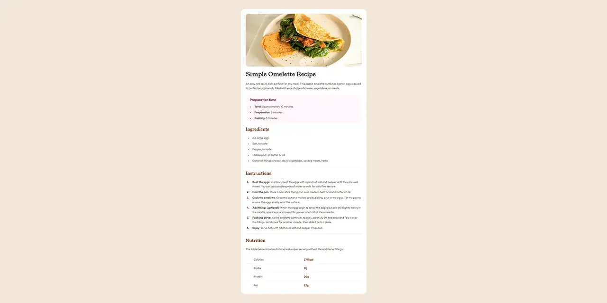

# Frontend Mentor - *Recipe page* solution

This is my solution to the [Recipe page challenge](https://frontendmentor.io/challenges/recipe-page-KiTsR8QQKm) on Frontend Mentor.

## Table of contents

- [Overview](#overview)
  - [Screenshot](#screenshot)
  - [Links](#links)
- [My process](#my-process)
  - [Tools](#tools)
  - [Features](#features)
  - [What I Learned](#what-i-achieved)
- [Resources](#resources)

## Overview

### Screenshot

### Links

- Solution URL: <https://frontendmentor.io/solutions/recipe-page-tO4hoBOjlg>
- Live Site URL: <https://erratic-enigma.github.io/recipe-page>

## My process

### Tools

- [Vite](https://vitejs.dev)
- [SCSS](https://sass-lang.com)

### Features

- Semantic HTML5 markup
- [RCCSS (Reasonable System for CSS)](https://rstacruz.github.io/rscss)
- CSS custom properties
- Flexbox
- CSS Grid

### What I achieved

## Resources

### Attributions

- **Fonts**
  - [Outfit](https://github.com/Outfitio/Outfit-Fonts)
  - [Young Serif](https://github.com/noirblancrouge/YoungSerif)
- **Images**
  - [a white plate topped with an omelet and greens](https://unsplash.com/photos/a-white-plate-topped-with-an-omelet-and-greens-SCZP5rvZINk)